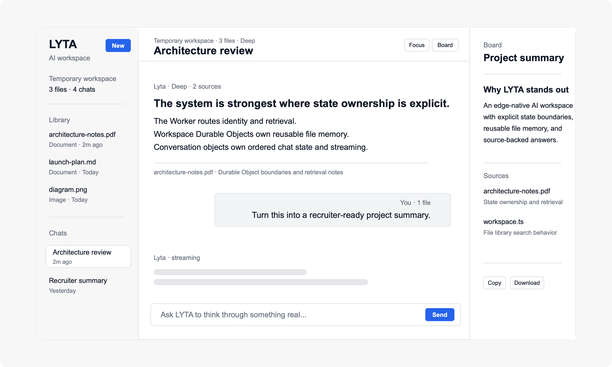
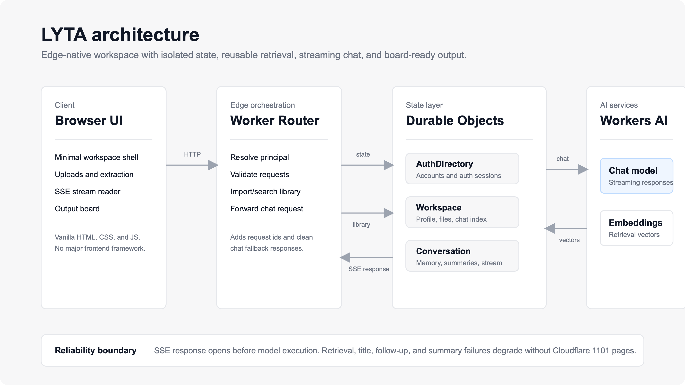
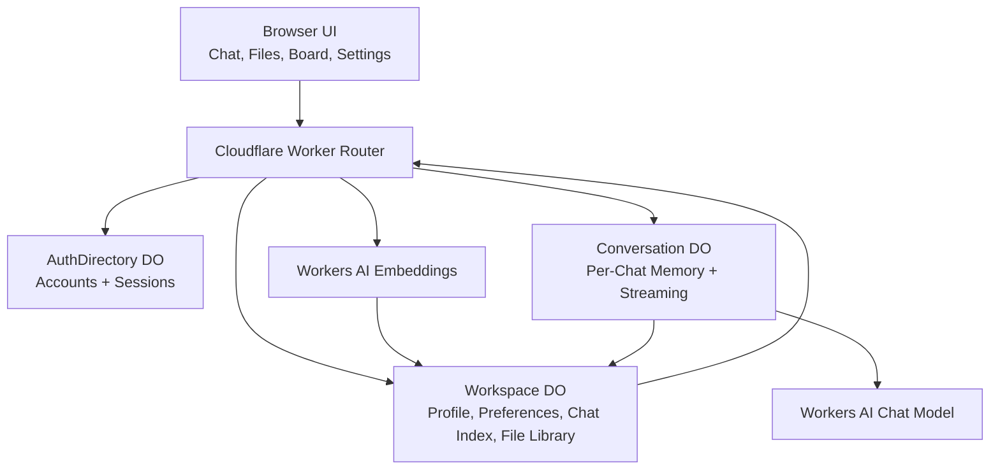
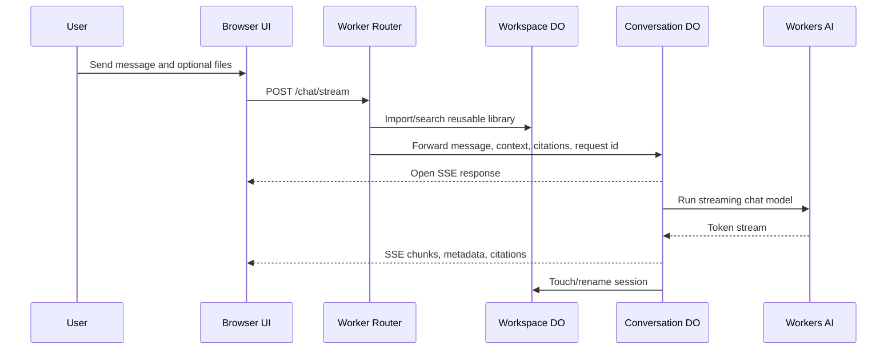

# LYTA


<p align="center">
  
</p>

<p align="center">
  <b>Edge-native AI workspace for technical work.</b><br/>
  Persistent workspaces · Reusable file memory · Retrieval with citations · Streaming chat · Output board
</p>

<p align="center">
  <a href="https://lyta.parthrohit-dev.workers.dev"><b>Live Demo</b></a> ·
  <a href="./ARCHITECTURE.md"><b>Architecture Notes</b></a>
</p>

## Overview

LYTA is a portfolio-grade AI workspace built on Cloudflare Workers, Durable Objects, and Workers AI. It is designed to demonstrate more than a prompt box: it models user state, file memory, retrieval, streaming, and output capture as a real product system.

The current product experience is intentionally minimal. The interface focuses on a quiet workspace rail, readable chat, reusable files, cited answers, and a document-style output board.

## What LYTA Does

- Starts immediately in guest mode with temporary server-backed workspace state.
- Supports account workspaces for persisted chats, files, profile data, and preferences.
- Ingests PDFs, DOCX, TXT, Markdown, CSV, JSON, HTML, XML, and images.
- Stores uploaded documents in a reusable file library instead of treating every upload as a one-off attachment.
- Retrieves relevant file snippets and returns source citations in chat and on the output board.
- Streams assistant responses over Server-Sent Events.
- Provides `Instant`, `Deep`, and `Creative` response modes.
- Generates short chat titles and follow-up prompts.
- Lets users pin strong assistant responses to a board for copy or Markdown export.

## Why This Is Technically Interesting

Most AI demos are stateless chat screens. LYTA is structured around explicit ownership boundaries:

- **Worker Router** resolves guest/account identity, validates requests, coordinates retrieval, and forwards normalized chat work.
- **AuthDirectory Durable Object** owns account records, password hashes, auth sessions, and token validation.
- **Workspace Durable Object** owns profile data, preferences, chat index, file metadata, document chunks, embeddings, and library search.
- **Conversation Durable Object** owns per-chat memory, ordered writes, summarization, title generation, follow-ups, and streaming persistence.
- **Workers AI** provides both chat generation and embedding generation.

The streaming path is hardened for demo reliability. `/chat/stream` establishes a valid SSE response before the model call runs, and model/retrieval failures degrade into clean LYTA errors instead of leaking Cloudflare 1101 HTML into the UI. Chat responses also include `X-Lyta-Request-Id` for log correlation, while logs avoid prompts, file text, emails, tokens, and full user data.

## Demo Walkthrough

1. Open the [live demo](https://lyta.parthrohit-dev.workers.dev).
2. Start as a guest and ask a technical question.
3. Upload a document and ask LYTA to summarize risks, decisions, or next steps.
4. Reuse the uploaded file from the library in another chat.
5. Compare `Instant`, `Deep`, and `Creative` response modes.
6. Pin a response to the output board and copy or download it.
7. Sign in to move from temporary guest state to a saved account workspace.

## Architecture

<p align="center">
  
</p>





### Core Building Blocks

| Layer | Responsibility |
| --- | --- |
| `pages/` | Vanilla HTML/CSS/JS workspace UI, uploads, auth modal, streaming chat, board |
| `src/router.ts` | Principal resolution, route validation, guest/account routing, library retrieval orchestration |
| `AuthDirectory` | Account records, password hashing, session tokens |
| `Workspace` | Profile, preferences, chat index, reusable file library, vector search |
| `Conversation` | Per-chat state, summaries, titles, follow-ups, SSE streaming, persistence |
| `services/ai.ts` / `services/embeddings.ts` | Workers AI model and embedding calls with normalized failures |

More detail lives in [ARCHITECTURE.md](./ARCHITECTURE.md).

## Feature Inventory

### Implemented

- Guest and account workspace modes
- Email/password account registration and login
- Persistent chat sessions for account workspaces
- Temporary guest sessions with isolated server-backed state
- File upload and browser-side document text extraction
- Reusable workspace file library
- Embedding-backed file retrieval with citations
- SSE streaming chat responses
- Response modes: `Instant`, `Deep`, `Creative`
- Chat title generation, summarization, and follow-up prompts
- Minimal output board with copy and Markdown download
- Request-id based chat error correlation
- Graceful degradation for AI/retrieval failures

### Known Tradeoffs

- Guest state is temporary and scoped to the guest cookie.
- Auth is email/password based, not OAuth or magic link.
- Retrieval uses Durable Object state rather than a dedicated external vector database.
- Browser-side extraction keeps the architecture compact but does not replace server-side OCR.
- The output board is a focused Markdown capture pane, not a full artifact runtime.

## Project Structure

```text
assets/
  architecture.svg         Source for the README architecture visual
  architecture.png         Rendered README architecture visual
  demo.svg                 Source for the README product preview
  demo.png                 Rendered README product preview

scripts/
  render_asset.swift       Renders SVG assets to PNG on macOS

pages/
  index.html               Main UI shell
  styles.css               Minimal workspace visual system
  app-core.js              Generated browser utility bundle
  app-attachments.js       Browser-side attachment preparation
  app.js                   Client logic for auth, chat, uploads, board, settings

pages-src/
  app-core.ts              TypeScript source for app-core.js

src/
  index.ts                 Worker entry point
  router.ts                Request orchestration and workspace routing
  auth/crypto.ts           Password and token helpers
  chat/messages.ts         Prompt shaping and message normalization
  durable/
    authDirectory.ts       Account and session storage
    workspace.ts           Workspace state, file library, preferences
    conversation.ts        Chat memory, streaming, follow-ups, summaries
  library/chunks.ts        Document chunking and citation formatting
  services/
    ai.ts                  Workers AI chat calls
    embeddings.ts          Embedding generation
    retriever.ts           Small built-in knowledge retriever
  utils/
    serverErrors.ts        Sanitized server error logging helpers
```

## Stack

- Cloudflare Workers
- Cloudflare Durable Objects
- Cloudflare Workers AI
- TypeScript
- Vanilla HTML, CSS, and browser JavaScript
- PDF.js
- Mammoth
- Server-Sent Events

## Local Development

### Requirements

- Node.js 18+
- Wrangler CLI
- macOS only for the optional SVG-to-PNG asset renderer

### Install

```bash
npm install
```

### Build Client Assets

```bash
npm run build:client
```

### Run Locally

```bash
wrangler dev --remote
```

Open:

```text
http://localhost:8787
```

### Render README Assets

```bash
swift scripts/render_asset.swift assets/demo.svg assets/demo.png 1600 960
swift scripts/render_asset.swift assets/architecture.svg assets/architecture.png 1600 900
```

## Verification

```bash
npm run build:client
./node_modules/.bin/tsc --noEmit
./node_modules/.bin/tsc -p tsconfig.client.json --noEmit
node --check pages/app-core.js
node --check pages/app.js
node --check pages/app-attachments.js
git diff --check
```

## Roadmap Ideas

- OCR for scanned PDFs and image-heavy documents
- Web research mode with explicit external citations
- Shareable board outputs or published artifact pages
- OAuth or magic-link authentication
- Retrieval quality metrics and latency dashboards
- Richer artifact generation beyond Markdown export

## Repo Quality Goals

LYTA is structured to be readable by reviewers:

- clear product story and live demo path
- explicit state ownership boundaries
- architecture diagrams that match implementation
- minimal frontend without framework overhead
- failure handling that preserves product polish during AI or retrieval issues
